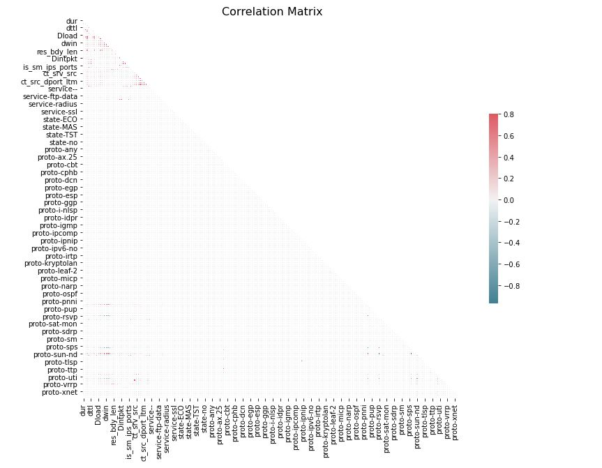

# Network Intrusion Detection System with Machine Learning Approach
### Capstone Data 606

### Author: Edwin Valdez (M.S.P. Data Science- University of Maryland Baltimore County) 

### Project Content
Table of contents
=================
<!--ts-->
* [Project Overview](#project-overview)
	* [Phase 1- Delivery](https://github.com/evaldez5/UMBC-Data-Science-606/tree/main/Phase%201-%20Delivery)
	* [Phase 2- Delivery](https://github.com/evaldez5/UMBC-Data-Science-606/tree/main/Phase%202-%20Delivery)
* [Data Description](#Data-Description)
* [Preliminary Results](#Preliminary-Results)
* [Images](https://github.com/evaldez5/UMBC-Data-Science-606/tree/main/Images)
* [Reference](#reference)

<!--te-->

#### Project Overview

This project aims to create a Network intrusion Detection System (NIDS) with machine learning capabilities. The system would monitor and detect malicious activity on the network that can lead to future attacks. The system would perform a classification approach with the neural network algorithm that would be able to predict if the network is malicious or normal. NIDS is a solution to the current increasing network attack issues to devices that can further damage a company. Many companies rely on services over the internet with the use of applications and transactions online. Therefore, this model system aims to provide another layer of protection/detection from possible network attacks that can affect those services. 

#### Logistic to implement
* The Network Intrusion Detection System (NIDS) would be implemented using a Neural Network algorithm using a pre-label dataset with network traffic containing normal and malicious activity. 
* Since we are dealing with large network traffic datasets, the neural network algorithm would be able to take the feature of those network traffic data (over 49 features) to predict if the activity is normal or abnormal (Malicious). 

#### Data Description
* For this project, we are going to use a pre-label dataset from the IXIA PerfectStorm tool in the Cyber Range Lab of the Australian Centre for Cyber Security (ACCS) with the title UNSW-NB15
* The dataset contains around two million network traffic records with 49 features to describe the network activity
* The dataset label is divided by normal and abnormal activity. In addition, there is a sub-attack-category that shows nine different attack categories: Fuzzers, Analysis, Backdoors, DoS, Exploits, Generic, Reconnaissance, Shellcode, and Worms. 
* Here is Graph showing the distribution of network attacks available in this datasets

* Here we have some graph showing the correlation between our features. 

#### Preliminary Results
In this project, I am using Keras Classifier algorithm to set up my neural network model. The initial configuration of my model contains 25 epochs and a batch size of 15. In addition, my setup includes six hidden layers with "relu" activation. As we were expected from our initial results, I consider the results to be off, and we are going to run some epoch and play with the number of hidden layers and batch size to reach a better accuracy where we can align the results with our validation data. Furthermore, I am going to perform a deep analysis of the data to determine which piece of network traffic I should keep and/or transform for better accurate results. However,  I found traffic data that will not be significant to our end prediction, which I will remove from our training datasets.

The following graph will show the loss data from our model

##### Reference
1- Abdelhameed M, Dr. Nour M. ( Nov. 14, 2018) The UNSW-NB15 Dataset Description [Data set] . The University of New South Wales. https://www.unsw.adfa.edu.au/unsw-canberra-cyber/cybersecurity/ADFA-NB15-Datasets/

2- Cuelogic Technologies. ( May 13, 2019). Evaluation of Machine Learning Algorithms for Intrusion Detection System. Medium. https://medium.com/cuelogic-technologies/evaluation-of-machine-learning-algorithms-for-intrusion-detection-system-6854645f9211

3- Almseidin, M., Alzubi, M., Kovacs, S., & Alkasassbeh, M. ( 2020). Evaluation of Machine Learning Algorithms for Intrusion Detection System. Mutah University, Amman,Jordan. https://arxiv.org/ftp/arxiv/papers/1801/1801.02330.pdf

4- Ahmad, Z., Khan, A., Shiang, C., Abdullah, J & Ahmad, F. ( Oct. 16, 2020) Network intrusion detection system: A systematic study of machine learning and deep learning approaches. Wiley Online Library. https://onlinelibrary.wiley.com/doi/full/10.1002/ett.4150

5- MLK. (Oct. 30, 2019) Animated Explanation of Feed Forward Neural Network Architecture. MLK making AI simple. https://machinelearningknowledge.ai/animated-explanation-of-feed-forward-neural-network-architecture/

6- Sharma, Bikash. ( Sept. 4, 2019) Evaluating a Machine Learning Model. Skyl.ai.  https://blog.skyl.ai/evaluating-a-machine-learning-model/

7- Stone, Mark. (2021, April 9). Intrusion Detection Systems (IDS) explained. AT&T. https://cybersecurity.att.com/solutions/intrusion-detection-system/ids-explained

8- Brownlee, Jason. (2016, Sept. 21). How To Improve Deep Learning Performance. Machine Learning Mastery. https://machinelearningmastery.com/improve-deep-learning-performance/

9- Wang, Chi-Feng. (2018, Aug.16). Different Ways of Improving Training Accuracy. Towards Data Science. https://towardsdatascience.com/different-ways-of-improving-training-accuracy-c526db15a5b2

10- Sharma, Pulkit. (2019, Nov. 7). 4 Proven Tricks to Improve your Deep Learning Model’s Performance. Analytics Vidhya. https://www.analyticsvidhya.com/blog/2019/11/4-tricks-improve-deep-learning-model-performance/

